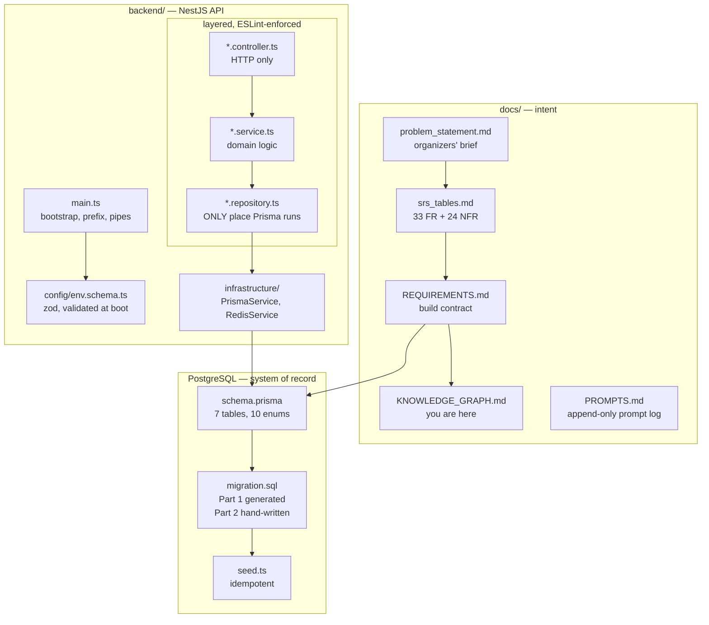
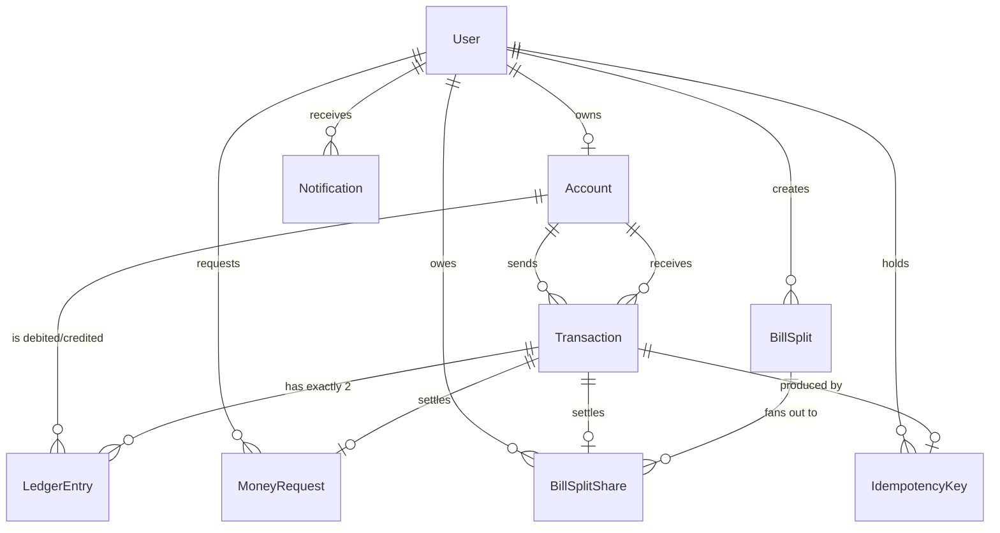
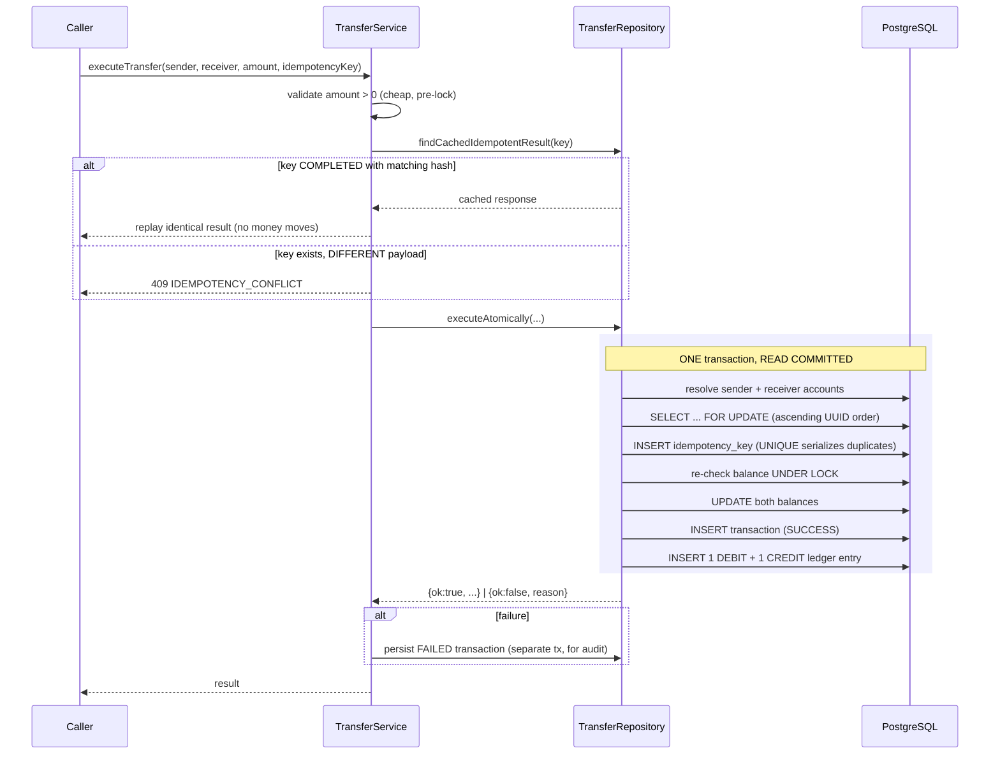

# Knowledge Graph

**Read this first.** It is the map of the project: what exists, how the pieces
connect, what is already decided (and why), and where to look for anything.

> **Orientation in one paragraph.** This is a closed-loop digital wallet built
> for the PSTU IT Carnival 2026 hackathon. Users register (auto-funded ৳100,000),
> send money, request money, and see history and realtime notifications. The
> challenge explicitly warns against "another CRUD app" — the whole point is
> being correct under concurrency, retries, and hostile input. Every design
> decision below serves that. **The single most important property in this
> codebase: money is never created or destroyed. `SUM(balance_poisha) = 0`
> across all accounts, always, and it is checkable in one query.**

---

## 1. The map



**Rule of thumb for an agent making changes:** intent flows down
(`problem_statement` → `srs_tables` → `REQUIREMENTS.md` → code). Never contradict
a document above the layer you are editing; if you must, update it and say so.

---

## 2. Where to look

| I need to… | Go to |
| --- | --- |
| Understand the challenge as issued | `docs/problem_statement.md` |
| Find a numbered requirement (FR-07, NFR-05…) | `docs/srs_tables.md` |
| Know what we actually committed to build | `docs/REQUIREMENTS.md` |
| See every prompt that shaped this repo | `docs/PROMPTS.md` (append-only) |
| Understand the data model + why floats are banned | `backend/prisma/schema.prisma` (header) |
| Find CHECK constraints / triggers / views | `backend/prisma/migrations/*/migration.sql` **Part 2** |
| See how money is issued into the system | `backend/prisma/seed.ts` |
| Know runtime prerequisites and env vars | `backend/REQUIREMENTS.txt` |
| Understand layering enforcement | `backend/eslint.config.mjs` |
| Add a feature module | copy the shape of `backend/src/modules/health/` |
| Understand bill splits (shared payments) | `backend/src/modules/bill-splits/`, schema.prisma's `BillSplit`/`BillSplitShare` models |
| Run the stack | `docker-compose.yml` (repo root) |

---

## 3. Architecture: the layer rule

```
HTTP  →  Controller  →  Service  →  Repository  →  Prisma / Redis  →  PostgreSQL
         transport      domain      ONLY DB access
         only           logic
```

Each layer may only call the one directly beneath it. This is **enforced by
ESLint, not convention** — `no-restricted-imports` rules in
`backend/eslint.config.mjs` fail the build on violation. Verified firing for:

- a controller importing a repository
- a service importing `PrismaService`
- `Math.round` / `parseFloat` anywhere (money is integer-only)
- `ledgerEntry.update / delete / upsert` anywhere (ledger is append-only)

**Why it matters here specifically:** a service that reaches past its repository
into the database is how a balance mutation ends up outside a transaction
boundary. The rule is a correctness guard, not a tidiness preference.

**One deliberate tension to know about.** Some validation (`balance >= amount`)
*must* happen inside the locked transaction, which lives in the repository. The
convention: repositories return **discriminated results**, never domain
decisions. `{ ok: false, reason: 'INSUFFICIENT_FUNDS' }` is data; what that means
for the caller is the service's job.

---

## 4. Data model



### The nine tables

| Table | Role | Mutability |
| --- | --- | --- |
| `users` | identity, auth | soft-delete only (`status = CLOSED`) |
| `accounts` | wallet + **cached** balance | balance updated only by conditional UPDATE under lock |
| `transactions` | business event, one per attempt (success *or* failure) | insert; status set at terminal state |
| `ledger_entries` | **double-entry, append-only** | **INSERT ONLY — trigger blocks UPDATE/DELETE/TRUNCATE** |
| `money_requests` | a claim for payment | status transitions only |
| `bill_splits` | a shared bill, fanned out to N participants | status transitions only |
| `bill_split_shares` | one participant's owed portion of a split | status transitions only |
| `idempotency_keys` | retry deduplication | ephemeral, TTL, cascades |
| `notifications` | user-facing feed | derived, cascades |

### Two ideas that explain the whole model

**1. Double entry with a SYSTEM account as the mint.**
`accounts.account_type = 'SYSTEM'` — exactly one row, enforced by a partial
unique index. It is the only account permitted a negative balance. Issuing a
user's ৳100,000 signup credit *debits* the system account by the same amount, so
the books balance from the very first row. That is what makes the global
invariant real rather than aspirational.

**2. `accounts.balance_poisha` is a cache; `ledger_entries` is the truth.**
The balance column exists for fast reads. The ledger is the system of record.
Replaying a ledger must reproduce the stored balance exactly — verified, and it
does. If they ever disagree, **the ledger is right**.

---

## 5. Invariant registry

These are the properties the system is judged on. Each is checkable.

| # | Invariant | How it is enforced | How to check |
| --- | --- | --- | --- |
| **I1** | `SUM(balance_poisha) = 0` across all accounts | double-entry + SYSTEM mint | `SELECT * FROM v_money_invariant` → `is_balanced` |
| **I2** | No USER balance is ever negative | `chk_accounts_balance_sign` + conditional UPDATE | `SELECT count(*) FROM accounts WHERE account_type='USER' AND balance_poisha < 0` |
| **I3** | Every SUCCESS transaction has exactly 2 ledger entries netting to 0 | application + view | `SELECT * FROM v_unbalanced_transactions` → must be empty |
| **I4** | Ledger replay reproduces every stored balance | append-only ledger | sum entries per account, compare to `balance_poisha` |
| **I5** | A ledger row, once written, never changes | `trg_ledger_entries_immutable` | attempt an `UPDATE` → errcode `23001` |
| **I6** | One retried request moves money at most once | `UNIQUE (user_id, key)` | replay a key, assert one transaction |
| **I7** | Money is integer poisha everywhere | `BIGINT` columns + ESLint bans | `grep` for `parseFloat` / `Math.round` |
| **I8** | A `BillSplit`'s `total_amount_poisha` always equals `SUM(shares.amount_poisha)` | enforced once, at creation, inside `BillSplitRepository.createSplit`'s transaction (no cross-row CHECK is possible) | `SELECT bs.id FROM bill_splits bs JOIN bill_split_shares s ON s.bill_split_id = bs.id GROUP BY bs.id, bs.total_amount_poisha HAVING bs.total_amount_poisha <> SUM(s.amount_poisha)` → must be empty |
| **I9** | A `BillSplit` is `SETTLED` iff every one of its shares is `PAID` | `SELECT ... FOR UPDATE` on the parent `bill_splits` row inside `payShare`, serializing the "any siblings still PENDING?" check — see the decision log | `SELECT bs.id FROM bill_splits bs WHERE bs.status = 'SETTLED' AND EXISTS (SELECT 1 FROM bill_split_shares s WHERE s.bill_split_id = bs.id AND s.status <> 'PAID')` → must be empty |

> **If you change money-handling code, re-check I1–I4.** They are cheap to
> verify and they are the difference between a working demo and a silent
> corruption.

---

## 6. Decision log

Decisions already made, with the reasoning. **Do not silently reverse these.**

| Decision | Why | Reversing costs |
| --- | --- | --- |
| **Money as `BIGINT` poisha, never float** | floats can't represent decimal fractions, aren't associative (two replays disagree), and rounding turns a representation error into a *value* error | the entire correctness argument |
| **Double-entry ledger, not balance-only** | makes "money is conserved" checkable rather than assumed | I1, I3, I4 all become unverifiable |
| **SYSTEM account may go negative** | it is the mint; its debt is the money in circulation | I1 breaks |
| **Ledger append-only, DB trigger enforced** | an editable ledger is a report, not an audit trail — replay proves nothing | auditability |
| **READ COMMITTED + row locks taken by conditional UPDATE** | predictable latency, no routine retry loop; SERIALIZABLE aborts under hot-account contention | see `transfer.repository.ts` comment |
| **Deterministic lock order (ascending account UUID)** | A→B and B→A concurrently would otherwise deadlock | deadlocks under load |
| **No separate `SELECT … FOR UPDATE`** | it was redundant with the conditional UPDATE and doubled the lock-hold window — measurably *caused* deadlocks | see §7.8 |
| **Bounded retry on 40P01 / 40001** | Postgres requires apps using row locks to be retry-ready; ordering makes deadlock rare, not impossible | rare 500s on valid requests |
| **Idempotency via `UNIQUE` violation, not check-then-insert** | check-then-insert is itself a race | I6 breaks |
| **ESM + `nodenext`, `.js` import specifiers** | NestJS 12 is ESM-only; CommonJS cannot import it | nothing compiles |
| **TypeScript pinned `~6.0.3`** | `@nestjs/schematics` needs `>=6.0.0`, `typescript-eslint` needs `<6.1.0` — only 6.0.x satisfies both | type-aware linting silently dies |
| **Prisma generator: `moduleFormat=esm`, `importFileExtension=js`** | otherwise the generated client emits unresolvable imports and — because it is `@ts-nocheck` — **every DB call becomes untyped with zero compiler errors** | silent, total loss of DB type safety |
| **Vitest, not Jest** | Nest 12 ships with it; ESM-native | ESM test config pain |
| **Prisma 7 driver adapter + `prisma.config.ts`** | Prisma 7 removed `datasource.url` from the schema | migrations stop resolving |
| **A settlement-shape CHECK constraint forces its status flip and its foreign-key attachment into one UPDATE, never two** | Postgres evaluates a (non-deferrable) CHECK at the end of the *statement* that touched the row, not at commit — an UPDATE that sets `status = 'ACCEPTED'`/`'PAID'` alone, before the settling transaction exists to attach, is rejected outright with SQLSTATE 23514, even though the surrounding application transaction would have fixed it up in its very next statement | see §7.10 — this was shipped broken (`acceptMoneyRequest`) until the bill-splits integration test caught the identical shape and both were fixed together |
| **`BillSplitRepository.payShare` takes `SELECT ... FOR UPDATE` on the parent `bill_splits` row before touching any share** | "has every sibling share been paid?" is an aggregate over *other* rows with no single-row conditional-UPDATE equivalent; under READ COMMITTED, two payers settling the last two shares at once could each check against a snapshot that predates the other's still-uncommitted PAID — locking the parent row first serializes exactly that pair | I9 becomes racy: a split can finish fully paid while stuck at `OPEN` |
| **`WalletRepository.acceptMoneyRequest` takes `SELECT ... FOR UPDATE` on the request row, not a conditional UPDATE** | needed to fix the CHECK-timing bug above — the claim now happens *before* the settling transaction exists, so it can no longer double as the state-flip; the lock (not a WHERE-clause guard) is what makes a double-accept safe now | double-clicking "Accept" could accept twice, or crash with 23514 |

---

## 7. Gotchas that will bite you

1. **`migration.sql` Part 2 is hand-written and NOT recoverable from
   `schema.prisma`.** Prisma cannot express CHECK constraints, partial indexes,
   expression indexes, triggers, or views. If you regenerate the migration, you
   must carry Part 2 across by hand.

2. **Relative imports need `.js` extensions**, even though the files are `.ts`.
   ESM + `nodenext`. `import { X } from './thing.js'`.

3. **`npx prisma` may fetch Prisma 8 from the registry** instead of the pinned
   local v7. Use `./node_modules/.bin/prisma` or an npm script.

4. **The seed runs via `tsx`, not `node`.** Node's native type-stripping does not
   remap `./client.js` onto the generated `client.ts`.

5. **`prisma generate` needs `DATABASE_URL` set** even though it never contacts
   the database. The Dockerfile passes a build-scoped placeholder.

6. **Seeded passwords use scrypt** (`scrypt$N$r$p$salt$hash`). When the auth
   module lands it must verify this format, or re-seed — otherwise demo accounts
   exist but cannot log in.

7. **`TransactionStatus` has no `COMPLETED`.** The success state is named
   `SUCCESS`. It is referenced by a CHECK constraint; renaming requires a
   migration.

8. **Do not reintroduce `SELECT … FOR UPDATE` into the transfer path.** It looks
   like the textbook thing to do, and it was in the first version. It is
   redundant — a conditional `UPDATE … WHERE balance_poisha >= :amt` already
   takes a row-exclusive lock and re-checks the balance atomically — and it
   doubles the number of round trips during which locks are held. Measured:
   with the extra selects, ~18 of 50 concurrent transfers died with SQLSTATE
   40P01 in about a third of runs, and the suite took 7–26s. Without them:
   **zero deadlocks across 10 runs, suite ~1.7s.** Balances were correct either
   way; the difference was whether valid callers got a 500.

9. **A self-transfer's FAILED audit row stores a NULL receiver.** Storing
   sender = receiver would violate `chk_transactions_no_self_transfer`. The
   constraint is not weakened for the audit path; `failure_reason =
   'SELF_TRANSFER'` already records what was attempted. An earlier version did
   not do this and the audit write failed silently.

10. **Never flip a row to a "settled" status in one statement and attach the
    settling transaction id in a later one, even in the same database
    transaction.** A CHECK constraint like
    `chk_money_requests_settlement_shape` or
    `chk_bill_split_shares_settlement_shape` is evaluated by Postgres at the
    end of the *statement* that touched the row — not deferred to commit the
    way a foreign key can be. `UPDATE ... SET status = 'ACCEPTED'` with
    `settled_transaction_id` still NULL fails outright with SQLSTATE 23514,
    full stop; there is no next statement in the transaction that can fix it,
    because that first statement never succeeded. `WalletRepository
    .acceptMoneyRequest` shipped with exactly this bug — every accept crashed
    against real Postgres — undetected because the only coverage was a unit
    test against a mocked repository, which cannot see a database constraint.
    It surfaced when `BillSplitRepository.payShare` hit the identical shape
    and an integration test against a real database (not a mock) caught it;
    both were fixed the same way: claim the row with a plain `SELECT` (or
    `SELECT ... FOR UPDATE` where something else needs the lock), do all the
    money movement, then perform exactly one `UPDATE` that sets the status,
    the timestamp, and the settling id together.

---

## 8. Current state

| Area | Status |
| --- | --- |
| Docs (problem, SRS, requirements, prompt log) | ✅ complete |
| Backend scaffold, layering, lint/format/strict TS | ✅ complete |
| `GET /health` (controller→service→repository) | ✅ complete, tested |
| Docker Compose (api + postgres + redis) | ✅ written, **not run** (no Docker on dev machine) |
| Local runtime: PostgreSQL 16 + Redis 8 via Homebrew | ✅ installed, running, wired to the API |
| Schema, migration, constraints, triggers, views | ✅ complete, **verified on real PostgreSQL 18** |
| Seed (5 demo users @ ৳100,000, idempotent) | ✅ complete, verified |
| **Transfer service + concurrency tests** | ✅ complete — see §9 |
| Auth (register / login / JWT / PIN / refresh rotation) | ✅ complete |
| Money requests (create/accept/reject) | ✅ complete — accept had a shipped bug against real Postgres, fixed; see §7.10 |
| Bill splits (shared payments: create, list, pay a share, auto-settle) | ✅ complete — `backend/src/modules/bill-splits/`, proven against real Postgres including the settlement race in §7.10/I9 |
| Transaction history endpoint | ✅ complete |
| Realtime notifications (socket) | ❌ not built (schema ready; `Notification` table exists, no WebSocket gateway) |
| Frontend (React 18 + Vite + Tailwind + React Query) | ✅ wired to the backend (see §12 — the mismatches listed there have since been fixed) |

**Demo credentials:** any seeded user (`alice@example.com` … `erin@example.com`),
password `Carnival#2026`.

---

## 9. The transfer path

The heart of the system. `TransferService.executeTransfer()`.



**Key points:**

- **Locking:** explicit `SELECT ... FOR UPDATE`, two separate statements issued
  in **ascending account-UUID order**. Two statements rather than one
  `IN (...) ORDER BY id FOR UPDATE`, because Postgres does not guarantee lock
  acquisition order matches `ORDER BY` under all plans. Determinism here is what
  prevents A→B / B→A deadlock.
- **Isolation:** READ COMMITTED + row locks, *not* SERIALIZABLE. Trade-off
  documented in `transfer.repository.ts`.
- **Idempotency:** the key is inserted **inside** the transfer transaction. A
  concurrent duplicate blocks on the unique index until the first commits, then
  loses and reads back the winner's response. The database does the serializing.
- **Failures are audited:** validation failure rolls the transfer back, then a
  `FAILED` transaction row is written in a **separate** transaction — it has no
  ledger entries, which is precisely what proves no money moved.

### Tests that back it

| Test | Asserts |
| --- | --- |
| `common/money.spec.ts` | integer-only parsing/formatting, no float path, round-trip |
| `transfers/transfer.service.spec.ts` | validation, idempotent replay, conflict detection, audit behaviour (mocked repo) |
| `test/transfer.concurrency.integration-spec.ts` | the real thing, against real PostgreSQL — see below |

The integration suite (16 tests) covers:

- **50 concurrent transfers on an underfunded account** → exactly 10 succeed, 40
  fail as `INSUFFICIENT_FUNDS` (not as errors), balance lands on exactly 0 and
  never goes negative, ledger replay equals the cached balance exactly.
- **50 concurrent retries of one idempotency key** → all 50 return the same
  reference, money moves once, exactly one TRANSFER ledger entry.
- **A→B and B→A simultaneously (60 transfers)** → no deadlock, balances restored.
- Reused key with a different payload → rejected as a conflict.
- Self-transfer, zero, negative, over-ceiling, unknown recipient → all rejected,
  balances untouched, and each is audited.
- `FAILED` rows carry **zero ledger entries** — the proof no money moved.
- `UPDATE`/`DELETE` on `ledger_entries` → rejected by the trigger.
- Global invariant `SUM(balance_poisha) = 0` holds at the end.

It runs against a **real PostgreSQL** booted in-process by `embedded-postgres`
— no Docker required. `npm run test:integration`.

---

## 10. Commands

**Local dependencies are already installed and running** as Homebrew services
(`postgresql@16`, `redis`). `brew services list` to check; they restart at login.

```bash
# from backend/
npm ci
cp .env.example .env        # defaults already point at 127.0.0.1
npm run db:setup            # generate + migrate deploy + seed, in one step
npm run start:dev

# if the services are not running
brew services start postgresql@16 && brew services start redis

# gates — all must pass
npm run typecheck
npm run lint
npm run format:check
npm test                    # unit (no DB)
npm run test:e2e            # HTTP layer (no DB)
npm run test:integration    # real Postgres, concurrency proof
                            # (boots its own throwaway cluster; does NOT touch
                            #  the Homebrew database)

npm run db:reset            # wipe + re-migrate + re-seed the local database

# from repo root
docker compose up --build
```

---

## 11. For an agent picking this up

1. Read `docs/REQUIREMENTS.md` §2–3 for the contract, then §5 above for the
   invariants.
2. Read the header of `backend/prisma/schema.prisma` — it explains the money
   representation and double entry better than any summary.
3. Before writing money code, read `transfer.repository.ts`. Match its shape.
4. **Append every new prompt to `docs/PROMPTS.md` before acting on it.** This is
   a standing rule for hackathon-judging transparency.
5. After any change to money handling, re-verify I1–I4 (§5).
6. Keep this file current. If you add a module, add it to §2 and §8; if you make
   an architectural decision, add it to §6.


---

## 12. Frontend ↔ backend wiring status (historical — resolved)

**As of this writing the frontend and backend are wired and talking.** The
table below is kept as a record of what was wrong and why, not a current
status report — every mismatch listed here has since been fixed on the
frontend side (base path, request/response shapes, PIN length, refresh
transport). Verified by reading `client.ts`, `walletApi.ts`, and
`AuthProvider.tsx` directly, not by re-probing the API. If you're touching
auth or the API client, this table is still useful context for *why* the
current shapes are what they are.

### Blocking mismatches

| # | Area | Frontend expects | Backend serves | Result |
| --- | --- | --- | --- | --- |
| 1 | **Base path** | `http://localhost:3000` + `/auth/login` | global prefix `api/v1` | **404 on every call** |
| 2 | **Login body** | `{ email, password }` | `{ identifier, password }` | 400 `property email should not exist` |
| 3 | **Register body** | `{ email, password, name, pin }` | `{ email, phone, username, displayName, password, pin }` | 400, missing 3 required fields |
| 4 | **Auth response** | `{ accessToken, user: { id, name, email } }` | `{ userId, username, accessToken, refreshToken, … }` | no `user` object → `AuthProvider` sets `user` to `undefined` |
| 5 | **Refresh transport** | cookie-based (`withCredentials`, empty body) | `{ refreshToken }` in body; **no `Set-Cookie` issued** | 400; silent-refresh loop cannot work |
| 6 | **PIN length** | 4 digits (`/^\d{4}$/`, `maxLength={4}`) | exactly 6 digits (`/^[0-9]{6}$/`) | every PIN rejected |
| 7 | **PIN flow** | `pin` sent in the transfer body | `POST /auth/pin/verify` → new token carrying `pin` claim; `PinGuard` reads the **claim** | a `pin` in the body authorises nothing |
| 8 | **Missing endpoints** | `/accounts/me/summary`, `/users/search`, `/transfers`, `/money-requests`, `/transactions` | none of these exist | 404 |

### Already correct

- **CORS** — preflight from `http://localhost:5173` returns 204 with
  `Access-Control-Allow-Origin`, `-Credentials: true`, and
  `Access-Control-Allow-Headers: content-type, authorization, idempotency-key`.
  The Vite port and `CORS_ORIGIN` match.
- **Idempotency header** — the frontend already sends `Idempotency-Key` on
  transfers and request accept/reject, which is exactly what the interceptor
  reads.
- **Money as strings** — `amountPoisha` is a string on both sides; no JSON
  numbers in the money path (NFR-C).
- **Bearer-token attachment and 401→refresh→retry** interceptor logic is sound;
  only the refresh *transport* is wrong.

### Also noted

- Root `package.json` is a leftover (React deps, no source). The real frontend
  is `frontend/` with its own `package.json`. The root one should be deleted or
  turned into a workspace root.
- `socket.io-client` is in the **root** package.json only; the real frontend
  does not depend on it and no socket server exists. Realtime (FR-F) is
  unbuilt on both sides.
- Seeded users (`alice`…`erin`) have **scrypt** password hashes and cannot log
  in against Argon2id verification. Only users created via `POST /auth/register`
  can authenticate.

### Decision needed before wiring

Item 5 is a genuine architecture choice, not a typo: refresh tokens in an
**httpOnly cookie** (frontend's assumption — XSS cannot read it, needs CSRF
protection) versus **in the response body** (backend's current design — client
stores it, simpler, but XSS-readable). Pick one and change the other side.
